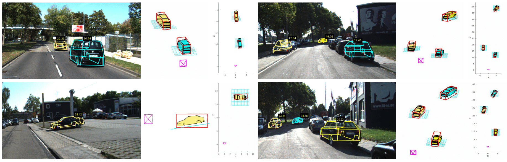
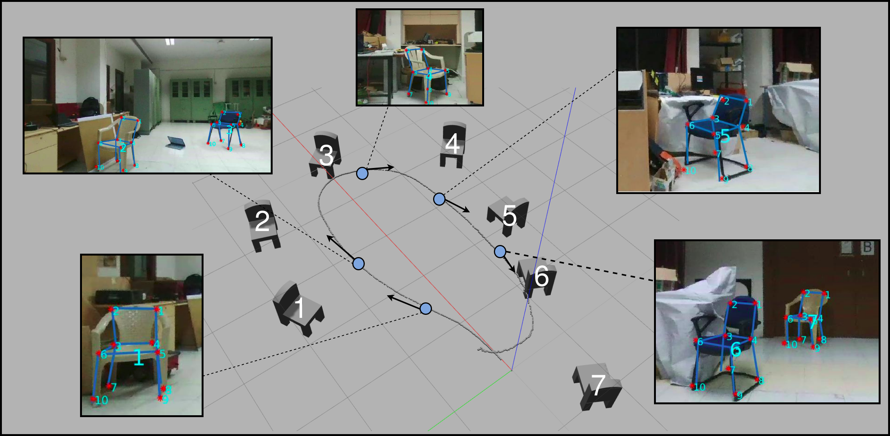
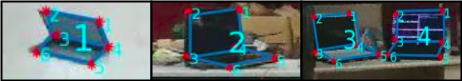

# Reconstructing vehicles from a single image: shape priors for road scene understanding

J. Krishna Murthy, G.V. Sai Krishna, Falak Chhaya, and K. Madhava Krishna

> **Note:** This is an abridged and simplified re-implementation of the ICRA 2017 paper _Reconstructing vehicles from a single image: shape priors for road scene understanding_. Several factors, including an agreement, delayed and prevented this release for over a year-and-a-half. Apologies for the inconvenience.

> **Contributors:** Original implementation by [*Krishna Murthy*](https://krrish94.github.io) 
> Re-implemented by [*Junaid Ahmed Ansari*](https://github.com/JunaidCS032) and [*Sarthak Sharma*](https://mila.quebec/en/person/sarthak-sharma/)

Should you find this code useful in your research, please consider citing the following publication.
```
@article{ Krishna_ICRA2017, 
author = { Krishna Murthy, J. and Sai Krishna, G.V. and Chhaya, Falak and Madhava Krishna, K. }, 
title = { Reconstructing Vehicles From a Single Image: Shape Priors for Road Scene Understanding }, 
journal = { ICRA }, 
year = { 2017 }, 
}
```

## Introduction

Our work presents one of the first techniques to reconstruct wireframe models of objects given just a single image. It is inspired by the fact that humans exploit prior knowledge of 3D shapes of objects to get a sense of how a 2D image of an object looks in 3D. We construct _shape priors_ that can be used to formulate a _bundle adjustment_-like optimization problem and help reconstruct 3D wireframe models of an object, given a single image.

<p align="center">
	
</p>


## Setup

This implementation used Python as well as C++ libraries. Here is how to set everything up and get started.

### Setup: Python dependencies

If you are using a conda environment or a virtuanenv, first `activate` it.

Install dependencies by running
```
pip install requirements.txt
```

### Setup: Ceres-Solver (C++)

Install [Ceres Solver](http://ceres-solver.org/index.html) by following instructions from [here](http://ceres-solver.org/installation.html).


### Build Ceres code (C++)

Switch to the directory named `ceresCode`.
```
cd ceresCode
```

Build the shape and pose adjuster scripts.
```
mkdir build
cd build
cmake ..
make
```
Ensure that Ceres Solver has been _installed_, before building these scripts.


## Running the demo

For now, we have included two examples from the [KITTI Tracking](http://www.cvlibs.net/datasets/kitti/eval_tracking.php) dataset. Run the `demo.py` script to view a demo.
```
python demo.py
```
> **Note:** This script MUST be run from the root directory of this repository.


## Running the code on some of your own examples (of car images)

If you are looking to run this code on some of your own examples of car images, you will first need the following information:
* **Height** above the ground at which the camera that captured the image is mounted.
* A **bounding box** of the car in (`x`, `y`, `w`, `h`) format, where `x` and `y` are the X and Y coordinates in the image of the top left corner of the bounding box, `w` is the bounding box width, and `h` is the bounding box height.
* **Keypoint locations**. Our approach relies on a predefined set of _semantic keypoints_ (wireframe vertices). These are obtained by extracting the region of the image inside of the bounding box, and passing it through a keypoint detector. We repurpose a [_stacked-hourglass model_](https://github.com/princeton-vl/pose-hg-train) for the same. _Stay tuned for the release of the keypoint network_
* **Viewpoint guess**. Our approach also relies on an initial (poor) guess of the azimuth (heading/yaw) of the car being observed. We follow the KITTI convention (KITTI calls this variable `ry` in their Tracking dataset ground-truth).

Look at the directory `data/examples` to get a sense of how to represent this data in a format that the `demo.py` script can process.


## Adapting the approach to novel object categories

This approach has successfully been ported to other object categories. (More on this to be added in due course.)

<p align="center">
	
</p>
<p align="center">
	
</p>
